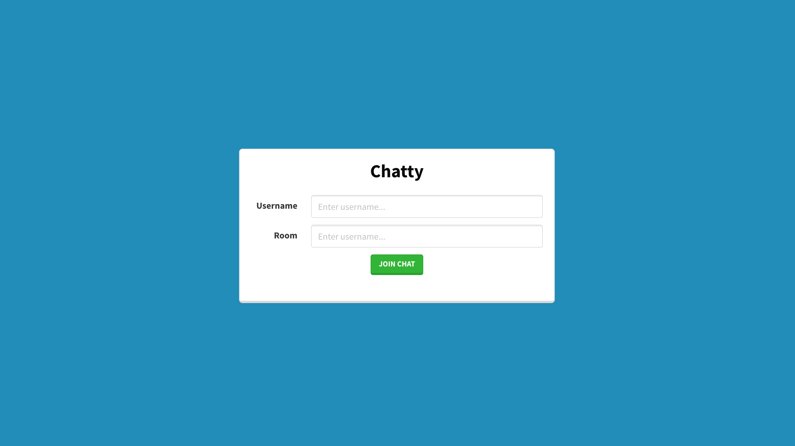
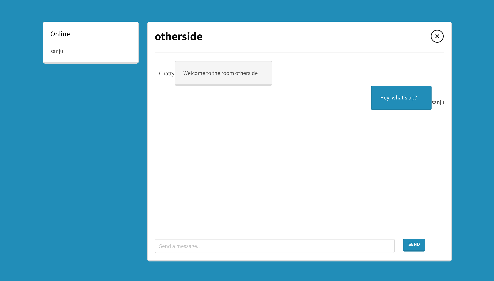

# Chatty

## Description
This is a React.js application that runs on a backend of express, node.js and socket.io. Currently, a user can type in their username and create a room and then join it. The room name can be used by a different users to connect to one room.

## Libraries and tools used
- React.js
- Bulma CSS
- Express
- Socket.io
- node.js

## Screnshots

## Run app locally
1. Clone the repo
2. npm install the dependencies for both the client and the server directories
3. npm run dev in the server directory
4. npm start in the client directory

## References
[Tutorial to connect a react app to a node.js socket server](https://www.youtube.com/watch?v=ZwFA3YMfkoc&t=2266s)

